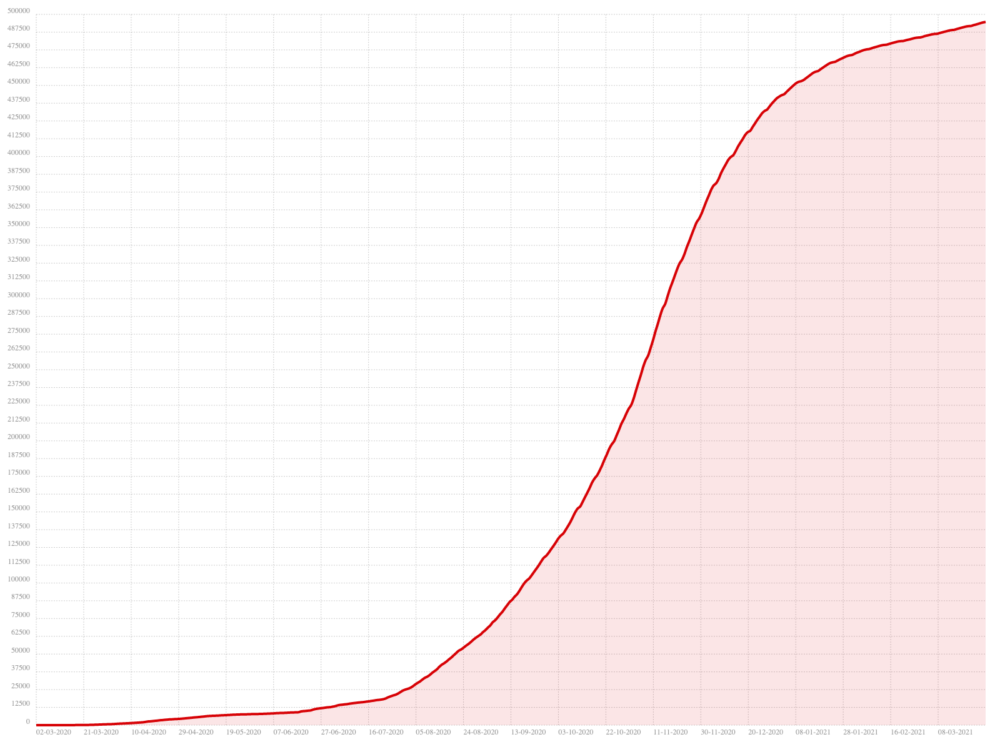

# MoroccoCovid19API
> Morocco Covid 19 API


## Built With
* [gson](https://github.com/google/gson)
* [sparkjava](https://github.com/perwendel/spark)


## Features
- Get all cases
- Get all cases by type
- Get the case number by type and date

## How To Use

> Get all cases :
```shell
curl http://localhost/cases/
```
Example of result :
```json
[
  {
    "date": "17-05-2020",
    "type": "recovered",
    "number": 3660
  },
  {
    "date": "17-05-2020",
    "type": "confirmed",
    "number": 6870
  },
  {
    "date": "18-05-2020",
    "type": "died",
    "number": 192
  },
  {
    "date": "18-05-2020",
    "type": "recovered",
    "number": 3758
  },
  {
    "date": "18-05-2020",
    "type": "confirmed",
    "number": 6952
  }
]
```
> Get all cases by type :
```shell
curl http://localhost/cases/died
```
Example of result :
```json
[
  {
    "date": "12-03-2020",
    "type": "died",
    "number": 1
  },
  {
    "date": "17-03-2020",
    "type": "died",
    "number": 2
  },
  {
    "date": "20-03-2020",
    "type": "died",
    "number": 3
  }
]
```
> Get the case number by type and date :
```shell
curl http://localhost/cases/died/12/03/2020
```
Example of result :
```json
{
  "date": "12-03-2020",
  "type": "died",
  "number": 1
}
```


## Examples
> Confirmed Cases :
```html
<!DOCTYPE html>
<html>
<head>
    <title>Confirmed Cases</title>
    <link rel="stylesheet" href="bower_components/chartist/dist/chartist.min.css">
    <script src="bower_components/chartist/dist/chartist.min.js"></script>
    <script src="bower_components/jquery/dist/jquery.min.js"></script>
</head>
<body>
<div class="ct-chart ct-perfect-fourth"></div>
<script>
    var the_labels = [];
    var the_series = [];
    $.ajax({
        url: "http://localhost/cases/confirmed/",
        type: 'GET',
        dataType: 'json',
        success: function (data) {
            $.each(data, function (index) {
                the_labels.push(data[index].date.toString().replace("-2020", ""));
                the_series.push(data[index].number);
            });
            var the_data = {
                labels: the_labels,
                series: [the_series]
            };
            new Chartist.Line('.ct-chart', the_data);
        }
    });
</script>
</body>
</html>
```



## Contributing

Contributions are what make the open source community such an amazing place to be learn, inspire, and create. Any contributions you make are **greatly appreciated**.

1. Fork the Project
2. Create your Feature Branch (`git checkout -b feature/AmazingFeature`)
3. Commit your Changes (`git commit -m 'Add some AmazingFeature'`)
4. Push to the Branch (`git push origin feature/AmazingFeature`)
5. Open a Pull Request

## License
[MIT License](https://choosealicense.com/licenses/mit/)


## Contact
- Yassine Lafryhi - [@YassineLafryhi](https://twitter.com/YassineLafryhi) - [y.lafryhi@gmail.com](mailto:y.lafryhi@gmail.com)
- Project Link : [https://github.com/Yassine-Lafryhi/MoroccoCovid19API](https://github.com/Yassine-Lafryhi/MoroccoCovid19API)