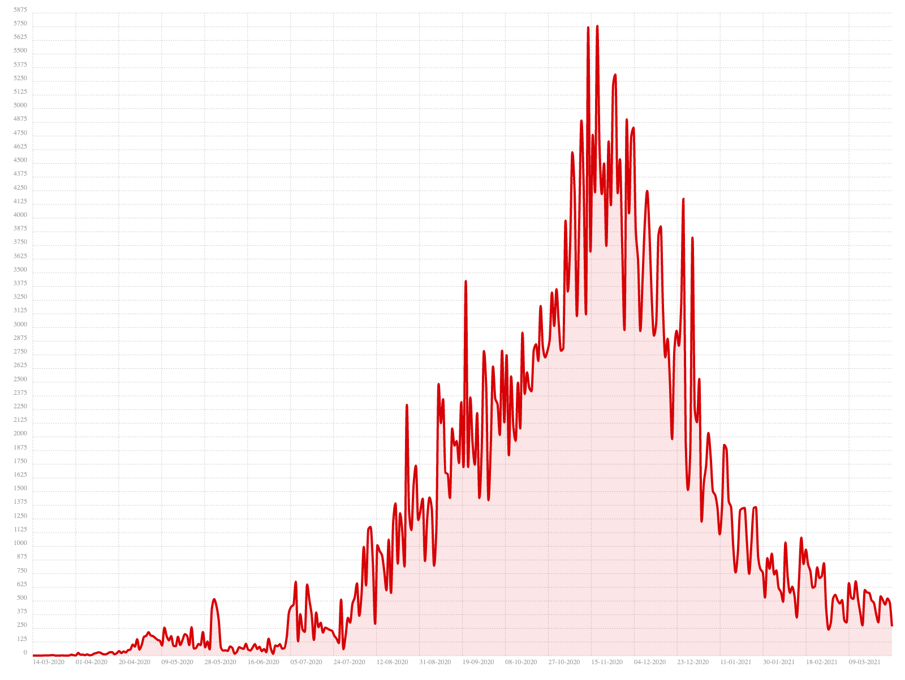
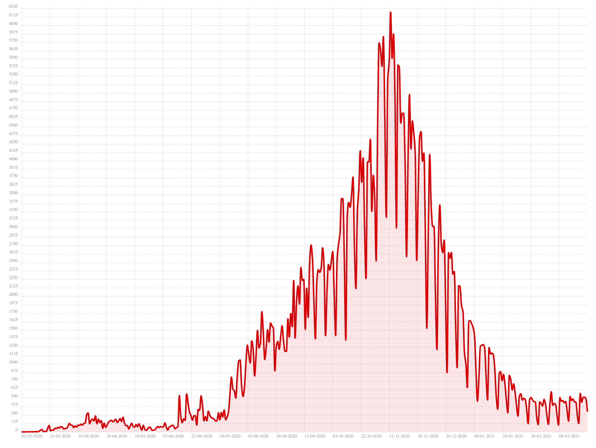

# MoroccoCovid19API
> Morocco COVID-19 API (cases: Confirmed,Recovered,Deaths) according to the Ministry of Health


## Built With
* [gson](https://github.com/google/gson)
* [sparkjava](https://github.com/perwendel/spark)


## Features
* [x] Get daily cases
* [x] Get total cases
* [x] Get total cases by type
* [x] Get the case number by type and date

## How To Use
> Get daily cases according to type :
```shell
curl http://localhost/cases/recovered/daily
```
Example of result :
```json
[  
     {
       "date": "16-03-2021",
       "type": "recovered",
       "number": 601
     },
     {
       "date": "17-03-2021",
       "type": "recovered",
       "number": 578
     },
     {
       "date": "18-03-2021",
       "type": "recovered",
       "number": 574
     },
     {
       "date": "19-03-2021",
       "type": "recovered",
       "number": 507
     },
     {
       "date": "20-03-2021",
       "type": "recovered",
       "number": 484
     },
     {
       "date": "21-03-2021",
       "type": "recovered",
       "number": 382
     },
     {
       "date": "22-03-2021",
       "type": "recovered",
       "number": 305
     },
     {
       "date": "23-03-2021",
       "type": "recovered",
       "number": 543
     },
     {
       "date": "24-03-2021",
       "type": "recovered",
       "number": 507
     },
     {
       "date": "25-03-2021",
       "type": "recovered",
       "number": 467
     },
     {
       "date": "26-03-2021",
       "type": "recovered",
       "number": 523
     },
     {
       "date": "27-03-2021",
       "type": "recovered",
       "number": 487
     },
     {
       "date": "28-03-2021",
       "type": "recovered",
       "number": 268
     }
   ]
  
```

> Get total cases :
```shell
curl http://localhost/cases
```
Example of result :
```json
[
    {
      "date": "21-03-2021",
      "type": "deaths",
      "number": 8767
    },
    {
      "date": "21-03-2021",
      "type": "recovered",
      "number": 479252
    },
    {
      "date": "21-03-2021",
      "type": "confirmed",
      "number": 491709
    },
    {
      "date": "22-03-2021",
      "type": "deaths",
      "number": 8769
    },
    {
      "date": "22-03-2021",
      "type": "recovered",
      "number": 479557
    },
    {
      "date": "22-03-2021",
      "type": "confirmed",
      "number": 491834
    },
    {
      "date": "23-03-2021",
      "type": "deaths",
      "number": 8775
    },
    {
      "date": "23-03-2021",
      "type": "recovered",
      "number": 480100
    },
    {
      "date": "23-03-2021",
      "type": "confirmed",
      "number": 492403
    },
    {
      "date": "24-03-2021",
      "type": "deaths",
      "number": 8786
    },
    {
      "date": "24-03-2021",
      "type": "recovered",
      "number": 480607
    },
    {
      "date": "24-03-2021",
      "type": "confirmed",
      "number": 492842
    },
    {
      "date": "25-03-2021",
      "type": "deaths",
      "number": 8788
    },
    {
      "date": "25-03-2021",
      "type": "recovered",
      "number": 481074
    },
    {
      "date": "25-03-2021",
      "type": "confirmed",
      "number": 493353
    },
    {
      "date": "26-03-2021",
      "type": "deaths",
      "number": 8793
    },
    {
      "date": "26-03-2021",
      "type": "recovered",
      "number": 481597
    },
    {
      "date": "26-03-2021",
      "type": "confirmed",
      "number": 493867
    },
    {
      "date": "27-03-2021",
      "type": "deaths",
      "number": 8798
    },
    {
      "date": "27-03-2021",
      "type": "recovered",
      "number": 482084
    },
    {
      "date": "27-03-2021",
      "type": "confirmed",
      "number": 494358
    },
    {
      "date": "28-03-2021",
      "type": "deaths",
      "number": 8798
    },
    {
      "date": "28-03-2021",
      "type": "recovered",
      "number": 482352
    },
    {
      "date": "28-03-2021",
      "type": "confirmed",
      "number": 494659
    }
  ]
```
> Get total cases by type :
```shell
curl http://localhost/cases/deaths
```
Example of result :
```json
[
   {
     "date": "16-03-2021",
     "type": "deaths",
     "number": 8737
   },
   {
     "date": "17-03-2021",
     "type": "deaths",
     "number": 8745
   },
   {
     "date": "18-03-2021",
     "type": "deaths",
     "number": 8748
   },
   {
     "date": "19-03-2021",
     "type": "deaths",
     "number": 8755
   },
   {
     "date": "20-03-2021",
     "type": "deaths",
     "number": 8763
   },
   {
     "date": "21-03-2021",
     "type": "deaths",
     "number": 8767
   },
   {
     "date": "22-03-2021",
     "type": "deaths",
     "number": 8769
   },
   {
     "date": "23-03-2021",
     "type": "deaths",
     "number": 8775
   },
   {
     "date": "24-03-2021",
     "type": "deaths",
     "number": 8786
   },
   {
     "date": "25-03-2021",
     "type": "deaths",
     "number": 8788
   },
   {
     "date": "26-03-2021",
     "type": "deaths",
     "number": 8793
   },
   {
     "date": "27-03-2021",
     "type": "deaths",
     "number": 8798
   },
   {
     "date": "28-03-2021",
     "type": "deaths",
     "number": 8798
   }
 ]
```
> Get the case number by type and date :
```shell
curl http://localhost/cases/deaths/28/03/2021
```
Example of result :
```json
{
  "date": "28-03-2021",
  "type": "deaths",
  "number": 8798
}
```


## Examples
> All Confirmed Cases :
```html
<!DOCTYPE html>
<html>
<head>
    <title>Confirmed Cases</title>
    <link rel="stylesheet" href="bower_components/chartist/dist/chartist.min.css">
    <script src="bower_components/chartist/dist/chartist.min.js"></script>
    <script src="bower_components/jquery/dist/jquery.min.js"></script>
    <script src="bower_components/moment/min/moment.min.js"></script>
</head>
<body>
<div class="ct-chart ct-perfect-fourth"></div>
<script>
    var the_data = [];
    $.ajax({
        url: "http://localhost/cases/confirmed",
        type: 'GET',
        dataType: 'json',
        success: function (data) {
            $.each(data, function (index) {
                the_data.push({x: moment(data[index].date, "DD-MM-YYYY"), y: data[index].number});
            });
            new Chartist.Line('.ct-chart', {
                series: [
                    {
                        name: 'confirmed',
                        data: the_data
                    }
                ]
            }, {
                low: 0,
                showArea: true,
                showPoint: false,
                fullWidth: true,
                axisX: {
                    type: Chartist.FixedScaleAxis,
                    divisor: 20,
                    labelInterpolationFnc: function (value) {
                        return moment(value).format('DD-MM-YYYY');
                    }
                }
            });
        }
    });
</script>
</body>
</html>
```


> Daily Recovered Cases :
```html
<!DOCTYPE html>
<html>
<head>
    <title>Daily Recovered Cases</title>
    <link rel="stylesheet" href="bower_components/chartist/dist/chartist.min.css">
    <script src="bower_components/chartist/dist/chartist.min.js"></script>
    <script src="bower_components/jquery/dist/jquery.min.js"></script>
    <script src="bower_components/moment/min/moment.min.js"></script>
</head>
<body>
<div class="ct-chart ct-perfect-fourth"></div>
<script>
    var the_data = [];
    $.ajax({
        url: "http://localhost/cases/recovered/daily",
        type: 'GET',
        dataType: 'json',
        success: function (data) {
            $.each(data, function (index) {
                the_data.push({x: moment(data[index].date, "DD-MM-YYYY"), y: data[index].number});
            });
            new Chartist.Line('.ct-chart', {
                series: [
                    {
                        name: 'daily-recovered',
                        data: the_data
                    }
                ]
            }, {
                low: 0,
                showArea: true,
                showPoint: false,
                fullWidth: true,
                axisX: {
                    type: Chartist.FixedScaleAxis,
                    divisor: 20,
                    labelInterpolationFnc: function (value) {
                        return moment(value).format('DD-MM-YYYY');
                    }
                }
            });
        }
    });
</script>
</body>
</html>
```


> Daily Confirmed Cases :
```html
<!DOCTYPE html>
<html>
<head>
    <title>Daily Confirmed Cases</title>
    <link rel="stylesheet" href="bower_components/chartist/dist/chartist.min.css">
    <script src="bower_components/chartist/dist/chartist.min.js"></script>
    <script src="bower_components/jquery/dist/jquery.min.js"></script>
    <script src="bower_components/moment/min/moment.min.js"></script>
</head>
<body>
<div class="ct-chart ct-perfect-fourth"></div>
<script>
    var the_data = [];
    $.ajax({
        url: "http://localhost/cases/confirmed/daily",
        type: 'GET',
        dataType: 'json',
        success: function (data) {
            $.each(data, function (index) {
                the_data.push({x: moment(data[index].date, "DD-MM-YYYY"), y: data[index].number});
            });
            new Chartist.Line('.ct-chart', {
                series: [
                    {
                        name: 'daily-confirmed',
                        data: the_data
                    }
                ]
            }, {
                low: 0,
                showArea: true,
                showPoint: false,
                fullWidth: true,
                axisX: {
                    type: Chartist.FixedScaleAxis,
                    divisor: 20,
                    labelInterpolationFnc: function (value) {
                        return moment(value).format('DD-MM-YYYY');
                    }
                }
            });
        }
    });
</script>
</body>
</html>
```


> Daily Deaths Cases :
```html
<!DOCTYPE html>
<html>
<head>
    <title>Daily Deaths Cases</title>
    <link rel="stylesheet" href="bower_components/chartist/dist/chartist.min.css">
    <script src="bower_components/chartist/dist/chartist.min.js"></script>
    <script src="bower_components/jquery/dist/jquery.min.js"></script>
    <script src="bower_components/moment/min/moment.min.js"></script>
</head>
<body>
<div class="ct-chart ct-perfect-fourth"></div>
<script>
    var the_data = [];
    $.ajax({
        url: "http://localhost/cases/deaths/daily",
        type: 'GET',
        dataType: 'json',
        success: function (data) {
            $.each(data, function (index) {
                the_data.push({x: moment(data[index].date, "DD-MM-YYYY"), y: data[index].number});
            });
            new Chartist.Line('.ct-chart', {
                series: [
                    {
                        name: 'daily-deaths',
                        data: the_data
                    }
                ]
            }, {
                low: 0,
                showArea: true,
                showPoint: false,
                fullWidth: true,
                axisX: {
                    type: Chartist.FixedScaleAxis,
                    divisor: 20,
                    labelInterpolationFnc: function (value) {
                        return moment(value).format('DD-MM-YYYY');
                    }
                }
            });
        }
    });
</script>
</body>
</html>
```


## Contributing

Contributions are what make the open source community such an amazing place to be learn, inspire, and create. Any contributions you make are **greatly appreciated**.

1. Fork the Project
2. Create your Feature Branch (`git checkout -b feature/AmazingFeature`)
3. Commit your Changes (`git commit -m 'Add some AmazingFeature'`)
4. Push to the Branch (`git push origin feature/AmazingFeature`)
5. Open a Pull Request

## License
[MIT License](https://choosealicense.com/licenses/mit/)


## Contact
- Yassine Lafryhi - [@YassineLafryhi](https://twitter.com/YassineLafryhi) - [y.lafryhi@gmail.com](mailto:y.lafryhi@gmail.com)
- Project Link : [https://github.com/Yassine-Lafryhi/MoroccoCovid19API](https://github.com/Yassine-Lafryhi/MoroccoCovid19API)
